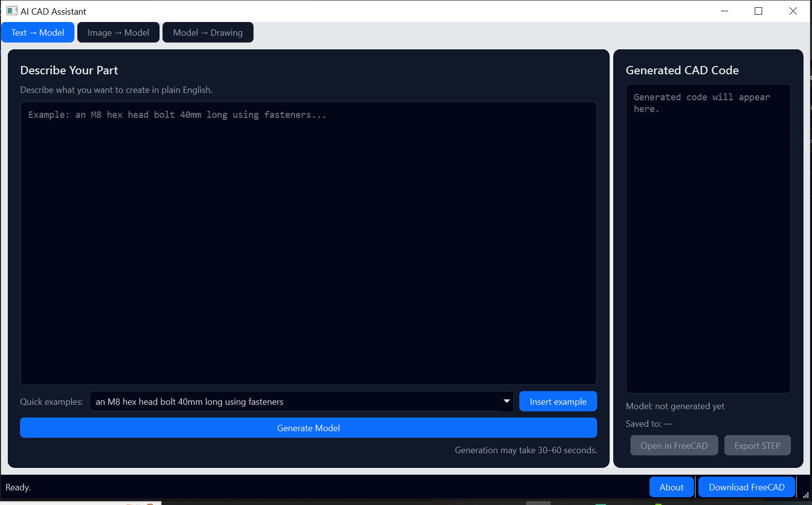

# AI CAD Assistant

AI‑powered parametric CAD assistant for FreeCAD + SolidWorks.

- Turn natural language into parametric parts (bolts, gears, flanges, brackets, etc.)
- Generate 3D models in FreeCAD and export to STEP for SolidWorks/Fusion
- Auto‑create simple engineering drawings with TechDraw

> Status: **Beta – Windows only**. Not for safety‑critical use.
>



## Features

- **Text → Model**: describe a part; the AI generates Python that calls safe helper
  functions in `cad_primitives.py`, including:
  - basic solids: `make_box`, `make_plate_with_hole`, `make_flange`, `make_cyl_with_hole`
  - fasteners: `make_fasteners_hex_bolt`, screw heads, hex nuts/bolts
  - gears: `make_spur_gear`, `make_helical_gear`, `make_internal_gear`,
    `make_bevel_gear`, `make_worm_gear`
  - structural parts (NEW): `make_rect_tube`, `make_pipe`, `make_stepped_shaft`,
    `make_flat_bar_2holes`, `make_drum_with_flange`
  - machining features (NEW): `make_shaft_with_keyway`, `make_plate_with_slot`,
    `make_plate_with_pocket`
- **Image → Model (experimental)**: basic detection of simple shapes from sketches /
  images to create an approximate 3D part.
- **Model → Drawing**: creates a TechDraw page (front + iso views, overall dims)
  and saves it.


### Example prompts

- an M8 hex head bolt 40mm long using fasteners
- a rectangular tube 600mm long, 40mm wide, 30mm high with 3mm wall thickness
- a shaft 25mm diameter and 200mm long with a 6mm wide, 3mm deep keyway
- a flat bar 200mm long, 25mm wide, 8mm thick with two 10mm holes 20mm from each end
- a plate 120mm by 50mm by 10mm with a 12mm wide slot along the length leaving 20mm at each end
- a plate 100mm by 60mm by 12mm with a central pocket 60mm by 30mm and 4mm deep
  
## Requirements

- Windows 10/11 (64‑bit)
- FreeCAD 1.0 (or ≥ 0.21) installed in `C:\Program Files\FreeCAD ...`
  or with `FREECAD_HOME` / `FREECAD_DIR` / `FREECAD_BASE` set
- [Ollama](https://ollama.com) installed and running locally
- At least one LLM pulled in Ollama (tested with `ollama pull llama3.2:3b`)
- Optional (for some helpers when running from source):
  - Fasteners workbench via FreeCAD Addon Manager
  - freecad.gears (Gears workbench) via FreeCAD Addon Manager

## Running from source (dev)

```powershell
git clone https://github.com/selassiewunimboribin/AI_CAD_Assistant.git
cd AI_CAD_Assistant
python -m venv .venv
.\.venv\Scripts\activate
pip install -r requirements.txt
# make sure Ollama is running and you have a model, e.g.:
#   ollama pull llama3.2:3b
python app_gui.py

## Download & Install (Windows)

1. Go to the [Releases](https://github.com/SamuelSelassieW/AI_CAD_Assistant/releases) page.
2. Download the latest `AI_CAD_Assistant_win.zip`.
3. Extract the zip (for example to `C:\AI_CAD_Assistant`).
4. Make sure you have:
   - **FreeCAD** installed (v1.0 or ≥ 0.21)
   - **Ollama** installed and running
   - At least one model pulled in Ollama, e.g.:
     ```bash
     ollama pull llama3.2:3b
     ```
5. In the extracted folder, run `AI_CAD_Assistant.exe`.

All processing stays on your machine – no data is sent to external servers.
